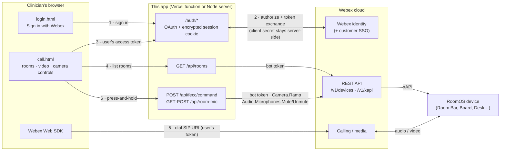
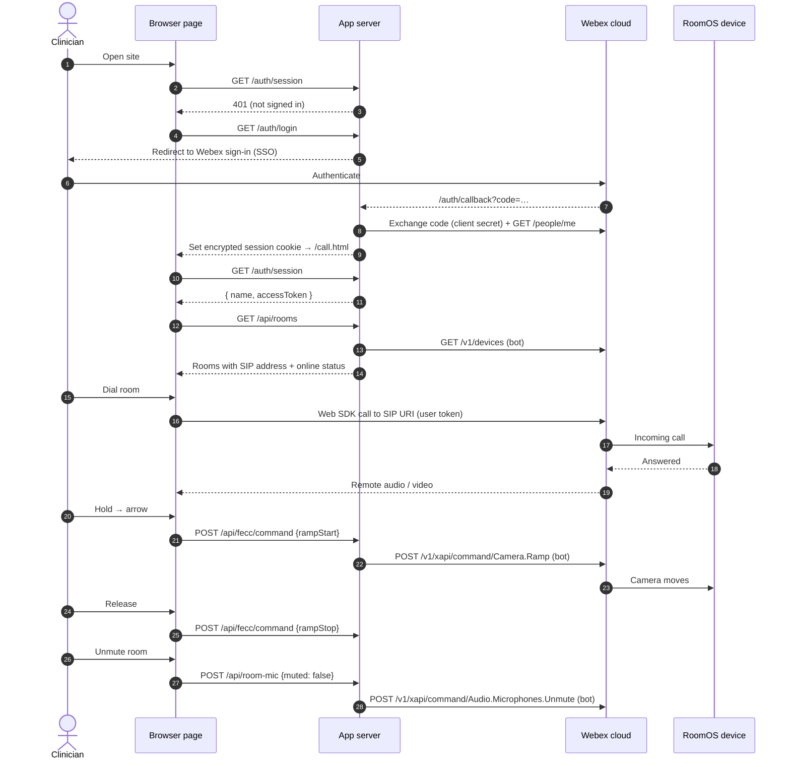

# Webex Room Calling with Far-End Camera Control

Call a Cisco RoomOS device from a web browser, see its video, and pan / tilt / zoom its camera from the same page — using only Webex cloud APIs. No Webex App, no on-premises call control, and no macro on the device.

Built for the "clinician checks on a room" use case: sign in with a Webex account (SSO works), pick a room, click **Dial**, and steer the far-end camera while you talk.

> Based on [wxsd-sales/webex-integrated-fecc](https://github.com/wxsd-sales/webex-integrated-fecc), which provides camera control inside the Webex App through a bot-created room tab. That flow is still included (see [Legacy: Webex App tab flow](#legacy-webex-app-tab-flow)).

**This is a demo / proof of concept, not a production service.** See [Security notes](#security-notes) and [Limitations](#limitations).

---

## Contents

- [What it does](#what-it-does)
- [Architecture](#architecture)
- [Prerequisites](#prerequisites)
- [1. Set up your Webex tenant](#1-set-up-your-webex-tenant)
- [2. Configuration](#2-configuration)
- [3. Deploy to Vercel](#3-deploy-to-vercel)
- [4. Run locally](#4-run-locally)
- [Using the app](#using-the-app)
- [Security notes](#security-notes)
- [Troubleshooting](#troubleshooting)
- [HTTP endpoints](#http-endpoints)
- [Project layout](#project-layout)
- [Optional: empty-room auto-answer macro](#optional-empty-room-auto-answer-macro)
- [Limitations](#limitations)
- [Legacy: Webex App tab flow](#legacy-webex-app-tab-flow)
- [License](#license)

---

## What it does

- **Sign in with Webex** (OAuth authorization-code flow). Works with any identity provider the Webex org uses for SSO. Optional allow-lists restrict who can sign in.
- **Room list** built automatically from every RoomOS device the bot has API access to, with live online/offline status. Refreshes every 30 seconds, so newly authorised workspaces appear without a redeploy.
- **Browser calling** with the [Webex Web SDK](https://developer.webex.com/meeting/docs/sdks/webex-meetings-sdk-web-quickstart): dials the room's SIP address and shows remote video, self-view, mute and hang-up.
- **Far-end camera control**: press-and-hold arrows and zoom with adjustable speeds, sent to the device as [xAPI `Camera.Ramp`](https://roomos.cisco.com/xapi/Command.Camera.Ramp/) through the [Webex cloud xAPI](https://developer.webex.com/docs/api/guides/device-xapi).
- **Remote room mute / unmute**: see whether the room's microphones are live and mute or unmute them for people who can't find the button (`Audio.Microphones.Mute` / `Unmute`). The state refreshes every few seconds, so changes made in the room show up too.

---

## Architecture



Two Webex identities are involved, each with one job:

| Identity | Held by | Used for |
|---|---|---|
| **Signed-in user** (OAuth Integration) | The browser, via the session | Placing the call with the Web SDK |
| **Bot** | The server only | Listing devices and sending `Camera.Ramp` commands |

The user never gets device-control rights of their own; the server decides what the bot does, and only for signed-in users.

### Call sequence



---

## Prerequisites

- A **Webex organisation** where you are a full administrator (to grant API access to workspaces).
- **Cloud-registered RoomOS devices** in workspaces. Cameras that support `Camera.Ramp` (PTZ cameras, Room Bar / Room Kit / Board / Desk series — some are digital pan/zoom). RoomOS 11.1 or later recommended.
- A **Webex user account** to sign in and place calls (any Webex user; it does not have to be in the same org as the devices, as long as that org accepts calls from it).
- **Node.js 20+** for local runs. A **Vercel** account (the free Hobby plan works) and a **GitHub** account for hosting.

---

## 1. Set up your Webex tenant

### 1a. Create a bot (device access)

1. Go to [developer.webex.com → My Webex Apps → Create a Bot](https://developer.webex.com/my-apps/new/bot).
2. Copy the **bot access token** → `WEBEX_BOT_TOKEN`. It is shown once; regenerate it if lost.

### 1b. Give the bot API access to each workspace

Access is granted per **workspace**, not per device (all devices in the workspace get it).

1. [Control Hub](https://admin.webex.com) → **Management → Workspaces** → open the workspace.
2. In the **Devices** section, open the **⋯** menu → **Edit API access**.
3. **Add user or bot** → select your bot → **Full access** → **Save**.
4. Repeat for every workspace that should appear in the app.

The room list picks up newly authorised workspaces within about a minute. Accessories in the workspace (Room Navigators, ceiling microphones) are skipped automatically.

> There is no bulk "grant API access" option for bots. For many rooms, an admin-authorised [Service App](https://developer.webex.com/docs/service-apps) or a [Workspace Integration](https://developer.webex.com/docs/integration-provided-features-in-control-hub) can cover the whole org — see [Limitations](#limitations).

### 1c. Check device settings

- **Far-end control** must be allowed: `Conference › FarEndControl › Mode` = **On** (the default). Set it in Control Hub → device → **Device configurations**, or for many devices with a configuration template.
- Cameras with **speaker tracking / auto-framing** active may ignore manual moves; turn tracking off during a call if the camera fights you.

### 1d. Create an OAuth Integration (user sign-in)

1. [developer.webex.com → My Webex Apps → Create an Integration](https://developer.webex.com/my-apps/new/integration).
2. **Redirect URI(s)** — add one per place you run the app, each ending in `/auth/callback`:
   - Vercel: `https://<your-project>.vercel.app/auth/callback`
   - Local tunnel: `https://<your-tunnel>.ngrok-free.app/auth/callback`
3. **Scopes**: tick **`spark:all`** and **`spark:kms`** (both are needed by the Web SDK to place calls).
4. Save, then copy the **Client ID** → `WEBEX_CLIENT_ID` and **Client Secret** → `WEBEX_CLIENT_SECRET`.

---

## 2. Configuration

All configuration is environment variables. Locally they are read from `.env` at start-up (copy [`.env.example`](.env.example)); on Vercel they are set in the project settings.

| Variable | Required | Purpose |
|---|---|---|
| `WEBEX_BOT_TOKEN` | **Yes** | Bot that lists devices and sends camera commands. |
| `WEBEX_CLIENT_ID` | **Yes** | OAuth Integration client ID. When set, sign-in is required for rooms and camera control. |
| `WEBEX_CLIENT_SECRET` | **Yes** | OAuth Integration client secret. Server-side only; also the default key for session cookies. |
| `WEBAPP_PUBLIC_URL` | Local: **yes** · Vercel: no | Public HTTPS origin, no trailing slash. The OAuth redirect URI is `<this>/auth/callback`. On Vercel the production domain is used when unset. |
| `ALLOWED_EMAILS` | No | Comma-separated emails allowed to sign in (case-insensitive). |
| `ALLOWED_ORG_IDS` | No | Comma-separated Webex org IDs (plain UUID from Control Hub → Account, or the base64 API form). |
| `SESSION_SECRET` | No | Key for session cookies instead of one derived from the client secret. |
| `DM_TAB_ENABLED` | No | `false` turns off the legacy bot DM + room tab (recommended unless you use the Webex App tab flow). |
| `PORT` | No | Local port (default `3000`). |

If **both** allow-lists are empty, any Webex user can sign in. If either is set, a user must match **one** of them.

---

## 3. Deploy to Vercel

1. **Put the code in your GitHub account** (fork or push this repository).
2. In Vercel: **Add New → Project** → import the repository.
   - **Application Preset: `Other`** (Vercel may guess *Express* — change it).
   - No build command or output directory changes are needed.
3. **Environment Variables**: add `WEBEX_BOT_TOKEN`, `WEBEX_CLIENT_ID`, `WEBEX_CLIENT_SECRET`, `DM_TAB_ENABLED=false`, and optionally `ALLOWED_EMAILS` / `ALLOWED_ORG_IDS`.
   - Do **not** set `WEBAPP_PUBLIC_URL` to a tunnel or localhost address; leave it unset on Vercel.
4. **Deploy**, then note the production address, e.g. `https://<your-project>.vercel.app`.
5. Add `https://<your-project>.vercel.app/auth/callback` to the Integration's **Redirect URI(s)** (step [1d](#1d-create-an-oauth-integration-user-sign-in)).
6. Open `https://<your-project>.vercel.app` → **Sign in with Webex** → dial a room.

**How it runs on Vercel.** Files in `public/` are served by Vercel's CDN. [`vercel.json`](vercel.json) rewrites every other path to [`api/index.js`](api/index.js), a serverless function that exports the Express app. Sessions are stored in an encrypted cookie rather than server memory, so any function instance can serve any user.

**Changing settings later.** Environment-variable changes only apply to new deployments: after editing, go to **Deployments → ⋯ → Redeploy**. Pushes to the default branch deploy automatically.

> **Hobby plan: "Blocked" deployments.** Vercel blocks Git-triggered deployments whose commit author it cannot match to your account. If pushes show **Blocked**, commit with an email linked to your GitHub account (for example your `ID+username@users.noreply.github.com` address): `git config user.email "<that address>"`, then push a new commit.

---

## 4. Run locally

Webex only accepts browser requests from **HTTPS pages on a real hostname**, so `http://localhost` cannot sign in or place calls. Use a tunnel.

```bash
npm install
cp .env.example .env        # then fill in the values
ngrok http 3000             # note the https://… forwarding address
```

Set `WEBAPP_PUBLIC_URL` in `.env` to the ngrok address, add `<ngrok address>/auth/callback` to the Integration's redirect URIs, then:

```bash
npm start
```

Open the **ngrok** address (not localhost). Restart `npm start` after any `.env` change. A reserved ngrok domain avoids updating the redirect URI each time ngrok restarts.

### Tests

```bash
npm test
```

Covers the room list (filtering, errors), the OAuth flow (state check, code exchange, allow-lists, refresh, tampered cookies) and route protection, against a faked Webex API.

---

## Using the app

1. Open the site and **Sign in with Webex**. Already signed in? You go straight to the calling page.
2. The left column lists rooms: green = online, grey = offline (cannot be dialled).
3. **Dial** a room and allow camera and microphone access. The room's video fills the centre; your self-view sits in the corner.
4. Hold an arrow or **+ / −** on the right to move the camera; release to stop. Sliders set pan, tilt and zoom speed.
5. **Room microphone** (top right) shows whether the room is muted; **Mute room / Unmute room** changes it. **Mute me** (above the video) mutes your own microphone.
6. **Hang up** to end the call; **Sign out** returns to the sign-in page.

---

## Security notes

- **Secrets stay server-side.** The bot token and the Integration client secret are never sent to the browser. The browser receives only the signed-in user's own access token, which the Web SDK needs to place the call.
- **Sessions** are AES-256-GCM encrypted, `HttpOnly`, `Secure`, `SameSite=Lax` cookies with a 12-hour lifetime; access tokens refresh automatically. Sign-out clears the cookie; because sessions are stateless, a copied cookie stays valid until it expires.
- **Protected routes.** `/api/rooms` and `/api/fecc/command` require a session whenever OAuth is configured. Use `ALLOWED_EMAILS` / `ALLOWED_ORG_IDS` on any public deployment — otherwise any Webex user can move your cameras.
- **Bot scope.** The bot can control every device it has been given access to. Grant it only on the workspaces this app should reach.
- **No patient data.** The server handles sign-in identity, device IDs and camera commands only. Media flows between the browser and Webex; nothing is recorded or stored by this app.
- **Device macro endpoints** (`/startup`, `/call`, `/call-end`) are unauthenticated for compatibility with the legacy macro. Leave `DM_TAB_ENABLED=false` unless you use that flow.

---

## Troubleshooting

| Symptom | Cause / fix |
|---|---|
| "Webex blocks sign-in from http://localhost…" | Open the app from its HTTPS address (Vercel or ngrok), not localhost. |
| Webex sign-in page shows `redirect_uri` mismatch | The redirect URI on the Integration must match `<site>/auth/callback` exactly. |
| "Webex sign-in is not configured on the server" | `WEBEX_CLIENT_ID` is missing (on Vercel: add it and **redeploy**; locally: restart the server). |
| "Your Webex account isn't allowed to use this page" | The account doesn't match `ALLOWED_EMAILS` / `ALLOWED_ORG_IDS`. |
| "No rooms — grant the bot Full access…" | The bot has no workspace API access yet (step [1b](#1b-give-the-bot-api-access-to-each-workspace)). |
| Room shows grey / Dial disabled | The device is offline in Control Hub. |
| Call connects but the camera doesn't move | Far-end control off, speaker tracking active, or the camera doesn't support `Camera.Ramp`. The status line under the controls shows the error. |
| Vercel deployments show **Blocked** | See the Hobby-plan note in [Deploy to Vercel](#3-deploy-to-vercel). |

---

## HTTP endpoints

| Method & path | Auth | Purpose |
|---|---|---|
| `GET /auth/login` | — | Starts Webex OAuth (sets a one-time state cookie). |
| `GET /auth/callback` | state cookie | Exchanges the code, checks allow-lists, sets the session cookie. |
| `GET /auth/session` | session | `{ name, email, accessToken }` for the Web SDK; refreshes the token when near expiry. |
| `POST /auth/logout` | — | Clears the session cookie. |
| `GET /api/rooms` | session¹ | `[{ name, sipUri, deviceId, online }]` from the bot's devices. |
| `POST /api/fecc/command` | session¹ | `{ deviceId, action: "rampStart" \| "rampStop", direction, panSpeed, tiltSpeed, zoomSpeed }` → `Camera.Ramp`. |
| `GET /api/room-mic?deviceId=…` | session¹ | `{ muted }` — the room's microphone mute state. |
| `POST /api/room-mic` | session¹ | `{ deviceId, muted: true \| false }` → `Audio.Microphones.Mute` / `Unmute`. |
| `GET /api/fecc/config` | — | Speed limits for the UI. |
| `POST /startup` · `/call` · `/call-end` | — | Legacy macro hooks. |

¹ Required when `WEBEX_CLIENT_ID` is set.

---

## Project layout

```
server.js              Express app: rooms, camera commands, legacy macro/tab flow
auth.js                Webex OAuth + encrypted cookie sessions + route guard
api/index.js           Vercel serverless entry (exports the Express app)
vercel.json            Rewrites non-static paths to the function
public/login.html      Sign-in page (site root redirects here)
public/call.html       Calling page: rooms · video · camera controls
public/webex-call.js   Web SDK sign-in, dialling, media, room refresh
public/fecc-controls.js  Press-and-hold camera controls (shared)
public/index.html      Legacy camera panel for the Webex App tab (?deviceId=…)
macro/empty-room-auto-answer.js  Optional RoomOS macro: answer only when the room is empty
macro/integrated-fecc.js  Legacy RoomOS macro (Webex App tab flow)
test/                  node:test suites (no extra dependencies)
docs/superpowers/      Design notes and implementation plans
```

---

## Optional: empty-room auto-answer macro

[`macro/empty-room-auto-answer.js`](macro/empty-room-auto-answer.js) runs on the device and answers an incoming call **only when people detection reports the room as empty**. If anyone is present, the call rings normally so they can choose to accept it. It is independent of the web app and works for any caller (browser, Webex App or SIP).

**Behaviour**

- Reads `RoomAnalytics.PeoplePresence` and `PeopleCount.Current` when a call comes in. Answers only if presence is **No** and the count is not above zero.
- **Fails safe:** if presence is unknown, unsupported or unreadable, the call rings.
- Waits `ANSWER_DELAY_MS` (2 s), then re-checks that the call is still ringing and the room still empty before answering.
- Never answers while the device is already in another call.
- Uses `Call.Accept` for that one call — it never switches on the device's `Conference › AutoAnswer` setting.
- Turns on `RoomAnalytics › PeoplePresenceDetector` at start-up if it is off.

**Install**

1. Device web interface (or Control Hub → device → **Macros**) → **Macro Editor** → create a macro, paste the file, save.
2. Toggle the macro **on** to open a test window, **off** to close it. Logs appear in the Macro Editor console.

**Restricting callers.** `ALLOWED_CALLERS` at the top of the file is empty (any caller). To restrict it:

| Entry | Matches |
|---|---|
| `'spark:<webex-user-id>'` | A Webex App or browser caller. Browser and Webex App calls arrive with this ID, **not** a SIP address. |
| `'room@partner.com'` | One SIP URI. |
| `'@partner.com'` | Any SIP URI in that domain. |

To find a caller's `spark:` ID, look at the device's call history after they have called once (`xCommand CallHistory Get DetailLevel: Full` → `CallbackNumber`), or take the UUID at the end of their decoded Webex person ID.

> **People detection is not a privacy guarantee.** It relies on face detection and ultrasound and can miss someone who is lying down, turned away or out of view. Treat empty-room auto-answer as a convenience for checking an unoccupied room, and keep the macro off outside supervised test periods.

---

## Limitations

- **Per-workspace bot access.** Every new room needs a Control Hub grant. For production, replace the bot with an admin-authorised **Service App** (org-wide device access, self-refreshing tokens) or a **Workspace Integration** scoped by workspace tags.
- **One camera per device.** Commands target `CameraId 1`.
- **No camera presets.** Only continuous pan / tilt / zoom.
- **Stateless sign-out** cannot revoke a copied session cookie before it expires (12 hours).
- **Web SDK version** is pinned (`webex@3.12.0` from jsDelivr); update deliberately and retest.

---

## Legacy: Webex App tab flow

The original project's flow still works if you want camera control inside the Webex App instead of a browser page:

1. Install [`macro/integrated-fecc.js`](macro/integrated-fecc.js) on the device, with `baseUrl` (line 3) set to your app's public HTTPS address, and enable it.
2. Set `DM_TAB_ENABLED` to anything other than `false`.
3. When the device receives a call from a Webex App user, the macro calls `/call`; the bot DMs the caller a **Camera Control** tab (`/?deviceId=…`). `/startup` and `/call-end` clean up the DM and tab.

Note: while OAuth is configured, the tab's camera commands also require the caller to be signed in to the app in that browser.

---

## License

MIT — see [LICENSE](LICENSE). Original project © 2023 Cisco Systems ([wxsd-sales/webex-integrated-fecc](https://github.com/wxsd-sales/webex-integrated-fecc)).

## Disclaimer

Everything included is for demo and proof-of-concept purposes only. Use of the site is solely at your own risk. This project may contain links to third-party content, which is not warranted or endorsed. It is not an official Cisco or Webex product; for questions about the original project, see the upstream repository.
